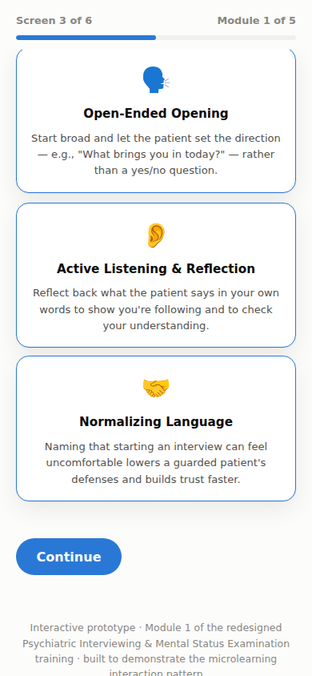

# Redesigning a Course Using Real Data

A learning experience design project by Fatima Hassan

## Why I Built This

Two other projects on this GitHub found and proved a real problem. A 6 hour behavioral health course, taken all in one sitting, had the lowest completion rate and the weakest learning results of anything in the entire medical school curriculum. Then a controlled experiment confirmed why: switching that same material to a shorter, spread out format fixed the problem.

Finding a problem is only half the job of an instructional designer. This project is the other half, the actual redesign, built the same way a real curriculum or training team would build it.

I took the specific course that the data pointed to, Psychiatric Interviewing and Mental Status Examination, and walked it through a complete, proven redesign process: studying the problem, designing a solution, building it, planning how to roll it out, and planning how to measure whether it worked. The end result is a working, clickable prototype of the first lesson.

As with the other projects in this series, the medical school, the students, and the data behind this redesign are all made up, built specifically so I could share this work publicly.

## What's Here

This project is less about analyzing numbers and more about turning a data finding into something real and built, the kind of work an instructional designer does after the numbers point to a problem.

The addie folder documents every stage of the redesign process: the study of what was going wrong and who the learners actually are, the new learning goals and how the course was broken into pieces, how it was built and quality checked, a plan for rolling it out and communicating the change, and a plan for measuring whether it actually worked, one that reuses the same SQL and Python tools from the first project instead of building new measurement tools from scratch.

The storyboard folder is a full, screen by screen plan for all five redesigned lessons, covering the visuals, the on screen text, the narration, how students interact with each screen, and where they go next. It is written the way you would actually hand it off to a developer to build.

The assessment folder maps every quiz question back to a specific learning goal, with sample questions and an explanation of why each wrong answer choice was chosen. Every wrong answer represents a real, common mistake, not a throwaway option just to fill space.

The prototype folder has a working build of the first lesson. You click through cards to reveal three techniques for opening a conversation with a patient, then answer a short quiz that gives you feedback right away. It is a plain web page, so anyone can open it in a browser and click through it themselves, no special software needed.



## The Redesign, Briefly

The original course bundled four separate skills, building rapport with a patient, performing a mental status exam, knowing how to ask about safety and risk, and writing it all up afterward, into one continuous 6 hour workbook with a single test at the end. Since none of those four skills actually depend on each other in order, they split cleanly into five short, focused lessons, adding up to about 60 minutes of real learning time total. Each lesson has its own quick check instead of one high pressure final exam, and the fifth lesson pulls everything together in one realistic scored scenario using all four skills at once, which is the real test of whether the training worked.

## Try the Prototype Yourself

Open the file called module_1_prototype.html directly in any web browser. No server or installation needed. Click through the technique cards and the quiz to see how the feedback works.

## Related Projects

This is the third of three related projects on my GitHub. The first project is Medical Student Behavioral Health Training Effectiveness and Learning Analytics, which found the original problem in the data. The second project, an experiment comparing short lessons to one long class, proved that the format itself was the cause. This project is the full redesign built in response to both.

## Putting This on GitHub

This folder is already set up as a git project. To publish it under your own GitHub account, run these three commands:

```bash
git remote add origin <your-repo-url>
git branch -M main
git push -u origin main
```
